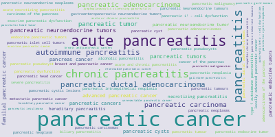
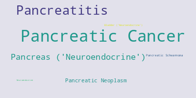
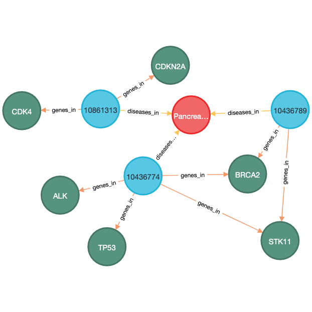

# Bio-Germline-Diseases-BERT-NER

To see previous version, click [here](https://github.com/arm-diaz/Bio-Germline-Diseases-BERT-NER)

THIS IMPLEMENTATION ENABLES THE USE OF GPU AND MULTI-CORE PARALLELISM FOR CPU OPERATIONS. WE ALSO IMPROVED THE NEN ALGORITHM BY USING CUSTOM REGULAR EXPRESSIONS BASED ON THE DICTIONARIES AND MUSC FEEDBACK.

## Workflow

## Dependencies

`Python 3.7`

## Setup

Install packages: `pip install  -r requirements.txt`

## Create Jupyter Notebook Kernel

`python -m ipykernel install --user --name=bio-germline-diseases-bert`

## Raw Data

Data can be found in the folder `data`.

Files:

+ `pubmed_abstracts`: Due to file size constraints, please contact me if you would like me to grant you access.
+ `LKP_Cancer_AKA`: CSV file contains list of germline cancers and alternative names.
+ `LKP_Gene_AKA`: CSV file contains list of germline genes and alternative names.

## Run Pipeline

### Data Exploratory Analysis

`nohup python src/exploratory_analysis/diseases.py &`
`nohup python src/exploratory_analysis/genes.py &`

### simpleGermKG: Tokenization, NER, and NEN

`nohup python src/simpleGermKG/diseases.py &`
`nohup python src/simpleGermKG/genes.py &`

### simpleGermKG: Neo4j

`nohup python src/simpleGermKG/graph.py &`

### Charts

`nohup python src/simpleGermKG/wordCloudChart.py &`

#### WordCloud Pancreatic Cancer: Named Entity Recognition

#### WordCloud Pancreatic Cancer: Named Entity Normalization

## Results

Results can be found in the folder `results`.

Files:

+ `Neo4J`: TXT file contains Cypher Code to build simpleGermKG in Neo4J
+ `PancreasBreastNeo4J`: TXT file for Pancreatic Cancer that contains Cypher Code to build simpleGermKG in Neo4J
  
## Graphs

### Pancreatic Cancer

## Neo4J Queries

+ MATCH (g:gene)<-[:genes_in]-(p:pubmed_id)-[:diseases_in]->(d:disease) WHERE g.name = 'BRCA2' RETURN p, g
+ MATCH (g:gene)<-[:genes_in]-(p:pubmed_id)-[:diseases_in]->(d:disease) WHERE d.name = 'Pancreatic Cancer' RETURN p, d, g
+ MATCH (g:gene)<-[:genes_in]-(p:pubmed_id)-[:diseases_in]->(d:disease) WHERE p.name IN ['10436774', '10861313', '10436789'] RETURN p, d, g
+ MATCH (g:gene)<-[:genes_in]-(p:pubmed_id)-[:diseases_in]->(d:disease) WHERE d.name = 'Pancreatic Cancer' RETURN p, d
